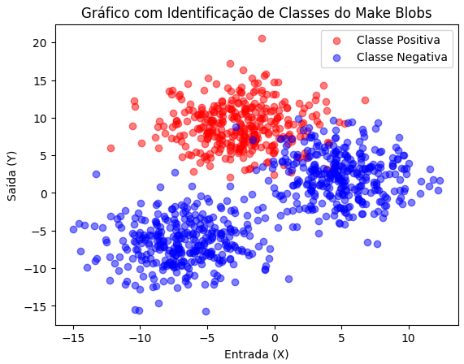
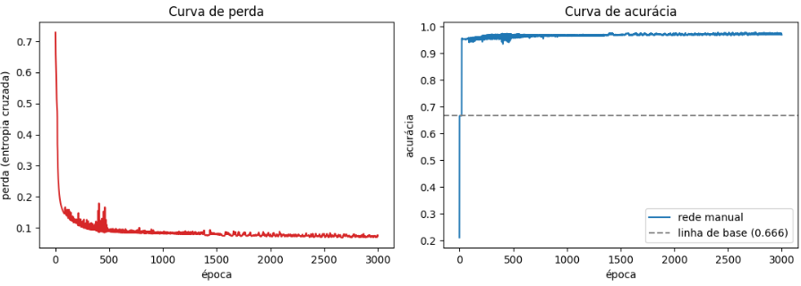
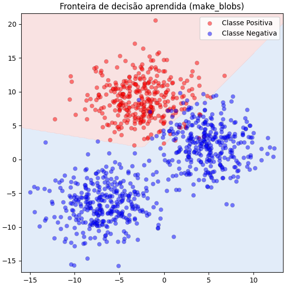
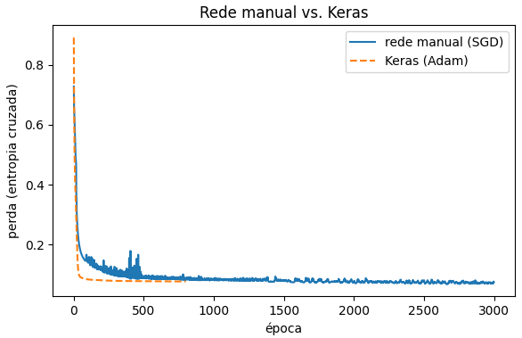

# Projeto Rede Neural

Equipe:

## Introdução

O presente trabalho apresenta o desenvolvimento e a implementação de um modelo de rede neural do tipo MultiLayer Perceptron (MLP), treinado via algoritmo de retropopagação do erro (BackPropagation). A proposta tem como referência o script exemplo4.py, apresentado na disciplina de Matemática para Ciência de Dados, promovendo alterações estruturais na topologia do modelo e na metodologia de avaliação, além da alteração da base de dados.

O conjunto de dados foi modificado substituindo a base no formato de meia-luas para agrupamentos gaussianos (blobs binarizados), nos quais foram introduzidos um elevado grau de sobreposição entre os grupos e um desbalanceamento amostral severo entre as classes. Além disso, a arquitetura de rede também foi estendida para um modelo mais profundo (*Deep Feedforward*), composto por duas camadas ocultas com três neurônios artificiais, mantendo a camada de saída com um neurônio. Além da função *Sigmoid*, a função *ReLU* (*Rectified Linear Unit*) foi introduzida para análise comparativa nas camadas ocultas. A otimização dos parâmetros foi realizada via gradiente descendente com a função de perda da Entropia de Cruzada Binária (*Binary Cross Entropy - BSE*).

| | `exemplo4.py` | Aqui |
|---|---|---|
| Base de dados | make_moons | make_blobs (desbalanceada de propósito) |
| Camadas ocultas | 1 | 3 |
| Neurônios | 2 → 1 | 8 → 6 → 4 → 1 |
| Ativação das ocultas | Sigmoide | ReLU |
| Ativação da saída | Sigmoide | Sigmoide |
| Função de perda | Erro quadrático | Entropia cruzada |

## **Base de dados**

A base de dados utilizada foi gerada pela função make_blobs,da biblioteca Scikit-learn, que gera  aglomerados (blobs) de pontos distribuidos de forma gaussiana. Essa base serve principalmente para testar e demonstrar algoritmos de aprendizado de máquina voltados para agrupamento (clustering, como o K-Means) e classificação.

Com o objetivo de criar um cenário mais desafiador e próximo da complexidade de dados reais, a base de dados foi configurada com 1000 amostras e um desvio padrão elevado. Isso torna os dados mais dispersos ao redor do cluster e, consequentemente, mais misturados e sobrepostos uns aos outros. O resultado é um conjunto de dados mais realista e, ao mesmo tempo, difícil para algoritmos de aprendizado de máquina identificarem divisões exatas entre as classes.

Além disso, a estrutura original do problema, que era multinomial, foi convertida em problema de classificação binária, mapeando a classe 0 como **classe positiva**, enquanto as classes 1 e 2 foram agrupadas para representar a **classe negativa**. A respectiva fusão tornou esse conjunto de dados desbalanceado, pois a classe negativa passou a concentrar o dobro de instâncias em relação á classe positiva, e, consequentemente, eleva o rigor dos testes, exigindo maior robustez dos modelos avaliados.

## Arquitetura de Redes Neurais

A arquitetura original da rede neural do tipo *Feedforward* (Camada única) foi expandida para uma estrutura de *Deep Feedforward* (Rede Profunda). Tal alteração envolveu o aumento do número de camadas ocultas de uma para três, bem como o incremento variado do número de neurônios artificiais em cada camada oculta.

Nossa arquitetura é $[2, 8, 6, 4, 1]$: 2 entradas, três camadas escondidas (8, 6, 4 neurônios), 1 saída.
Em código (com exemplos em linha, não em coluna), cada $W^{(l)}$ tem forma `(tamanhos[l], tamanhos[l+1])`.

### Funções de ativação

Em relação a funções de ativação, além da função *Sigmoid* utilizada originalmente no modelo base, a função *ReLU* (*Rectified Linear Unit*) foi escolhida para análise comparativa nas camadas ocultas.

- **Sigmoide**: $\sigma(v) = \dfrac{1}{1+e^{-v}}$, com derivada $\sigma'(v) = \sigma(v)(1-\sigma(v))$ — usada só na saída, porque comprime o resultado entre 0 e 1 (interpretável como probabilidade).
- **ReLU**: $\text{ReLU}(v) = \max(0, v)$, com derivada $1$ se $v>0$ e $0$ caso contrário — usada nas 3 camadas escondidas, porque sua derivada não encolhe para entradas positivas, evitando o vanishing gradient numa rede mais profunda que a original.

Na saída final, foi utilizada a função Sigmoide, tornando a rede ideal para tomar decisões de sim ou não (classificação binária).

### Função de custo e retropropagação do erro

Para medir a precisão dos palpites do modelo, foi adotada a Entropia Cruzada Binária como função de custo. Essa escolha é superior ao erro quadrático comum porque evita que o algoritmo fique "travado" em regiões sem aprendizado durante o treinamento. A combinação da função de saída com esse método de custo cria uma métrica limpa baseada na diferença direta entre a resposta correta e a previsão feita, acelerando o processo para que o modelo aprenda de forma rápida e estável.

O aprendizado propriamente dito ocorre no caminho de volta (propagação reversa), onde a rede calcula o tamanho do erro cometido na saída e o distribui regressivamente por todas as camadas anteriores. Com base nessa margem de erro, o algoritmo identifica a contribuição individual de cada peso e viés da rede. Em seguida, utilizando a otimização por gradiente descendente, os parâmetros do modelo são ajustados passo a passo para reduzir as falhas em previsões futuras.

Por fim, para garantir que os cálculos analíticos de ajuste de erro estivessem absolutamente corretos na implementação manual em código puro, aplicou-se a técnica de Verificação Numérica do Gradiente. Esse teste compara os resultados gerados pelas equações da rede com pequenas variações calculadas diretamente sobre a função de custo. A precisão extrema dos resultados obtidos confirma que todo o motor matemático do algoritmo funciona perfeitamente, sem a necessidade de bibliotecas externas de diferenciação automática.

## Treinamento

O treinamento da rede neural é executado por meio de um processo de gradiente descendente em lote completo (full-batch), no qual cada uma das 3.000 épocas processa a totalidade dos 1.000 exemplos do conjunto de dados de uma só vez. A cada ciclo, o algoritmo calcula a propagação direta (forward), avalia a função de perda e a acurácia, obtém os gradientes via propagação reversa (backward) e atualiza os pesos e viéses utilizando uma taxa de aprendizado ($\eta$) de 0,5. Para garantir um aprendizado fidedigno e sem vazamento de estados anteriores, os parâmetros da rede são reinicializados do zero no início do procedimento com uma semente fixa.

Os resultados demonstraram a eficácia do modelo em aprender os padrões da base de dados, composta por 334 exemplos positivos e 666 negativos. Enquanto a linha de base ingênua — que consiste em classificar sempre a classe majoritária — atinge uma acurácia de 66,60%, o modelo inicia a primeira época com uma perda de 0,7284 e acurácia de apenas 21,00%. Ao longo do treinamento, a rede apresentou uma convergência contínua, reduzindo progressivamente o custo e alcançando, ao final das 3.000 épocas, uma perda final de 0,0744 e uma acurácia final de 97,30%, superando amplamente o desempenho de referência.

## Resultado

Para validar o desempenho da arquitetura desenvolvida, a avaliação do modelo abrangeu a análise de curvas de aprendizado, a visualização da fronteira de decisão no espaço bidimensional e uma verificação comparativa (*benchmark*) contra a biblioteca *Keras/TensorFlow*.

### 1. Curvas de Aprendizado e Desempenho

Devido ao desbalanceamento de classes introduzido no conjunto de dados (66,6% das instâncias pertencentes à classe negativa e 33,4% à classe positiva), a métrica de acurácia isolada pode ser enganosa, visto que um classificador ingênuo estático alcançaria 66,6% de acurácia sem qualquer aprendizado. 

Conforme ilustrado nos gráficos de acompanhamento por época:
* **Evolução da Perda:** A função de custo (Entropia Cruzada Binária) apresenta decaimento acentuado durante as primeiras épocas, estabilizando em um valor final de **0,0744**.
* **Evolução da Acurácia:** O modelo parte de um desempenho inicial de 21,00% na época 0 e atinge **97,30%** ao término das 3.000 épocas, superando amplamente a linha de base de 66,60%.

### 2. Fronteira de Decisão

A capacidade da rede profunda de separar o espaço de características bidimensional ($X \in \mathbb{R}^2$) é evidenciada na visualização da fronteira de decisão. A combinação das três camadas ocultas com ativação **ReLU** permitiu ao modelo delimitar uma região não linear complexa e contínua em torno do cluster positivo (classe 0), isolando-o do conjunto majoritário mesmo sob expressiva sobreposição gaussiana.

### 3. Comparativo: Rede Manual (SGD) vs. Keras (Adam)

Para atestar a exatidão matemática da implementação em *NumPy*, construiu-se uma arquitetura idêntica `[2, 8, 6, 4, 1]` na biblioteca *Keras*, mantendo a mesma função de custo (Entropia Cruzada) e avaliando a convergência.

* **Otimizador:** Enquanto a rede manual utiliza Gradiente Descendente Estocástico em lote completo (SGD/GD, $\eta = 0,5$), o Keras foi configurado com o otimizador *Adam* ($\eta = 0,01$), adequado para evitar estagnação em mínimos locais durante o treinamento via TensorFlow.
* **Convergência:** Ambas as abordagens convergiram para níveis equivalentes de custo e acurácia. A rede manual alcançou acurácia final de **97,30%** com perda de **0,0744**, corroborando a corretude da arquitetura, das derivações analíticas do *backward pass* e da atualização dos parâmetros.

## 10. Conclusão

Este trabalho apresentou a evolução e generalização do modelo base (`exemplo4.py`), expandindo uma arquitetura rasa para uma rede neural profunda (*Deep Feedforward*) totalmente vetorizada, capaz de suportar topologias arbitrárias de $L$ camadas. A substituição do cálculo escalar por operações matriciais na arquitetura $[2, 8, 6, 4, 1]$, aliada ao uso da função de ativação **ReLU** nas camadas ocultas, resolveu o problema do desaparecimento do gradiente (*vanishing gradient*) e permitiu à rede mapear fronteiras de decisão não lineares complexas.

A adoção da **Entropia Cruzada Binária** em substituição ao Erro Quadrático Médio foi determinante para otimizar o processo de convergência, eliminando platôs de aprendizado e estabilizando a atualização dos parâmetros via Gradiente Descendente. A exatidão matemática da implementação em código puro (*NumPy*) foi rigorosamente validada por meio da **Verificação Numérica do Gradiente** (*Gradient Checking*), cujo erro relativo ficou substancialmente abaixo do limite crítico aceitável ($10^{-7}$).

Mesmo diante de um cenário desafiador — caracterizado por uma base de dados gaussiana (`make_blobs`) com desbalanceamento severo e forte sobreposição entre classes —, a rede manual atingiu uma acurácia final de **97,30%** e uma perda de **0,0744**. A validação cruzada contra um modelo equivalente implementado na biblioteca *Keras/TensorFlow* confirmou a equivalência de desempenho e a correta convergência de ambas as abordagens, atestando a precisão analítica do *forward* e *backward pass* desenvolvidos do zero.